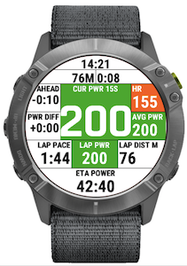
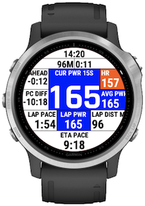
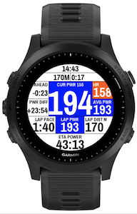
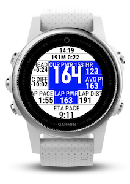

# RunPowerWorkout

RaceWithPower is a datafield designed to show you useful metrics while racing with power as main metric.

# Fields and features

1. Time of day
2. Total distance (corrected)
3. Total duration
4. Ahead/Behind for elapsed distance
5. Current power (averaged on custom window)
6. Heart rate, optionally coloured by zone
7. Difference between current power/pace and target time for remaining distance
8. Average power for the whole race
9. Current lap pace (corrected)
10. Current lap power (corrected)
11. Current lap distance (corrected)
12. ETA based on current lap power and pace

Customization is possible :
* Alert outside of race power target
* Correct distance by pressing on a lap button (within -/+ 10% of the lap distance)
* Choose colors to display (None, Foreground only, Background and Foreground)
* Choose to use custom font (narrower) or standard.
# Settings

* Set up race parameters : distance, elevation, target power and target time.
* Show power in raw value or percentage of FTP
* Choose power averaging window (1-30 seconds)
* Enable alerts outside of race power target

# Screenshots

### Pragati Font License

Copyright (c) 2012-2015, Omnibus-Type (www.omnibus-type.com omnibus.type@gmail.com)

Licensed under the [SIL Open Font License, 1.1](https://scripts.sil.org/cms/scripts/page.php?site_id=nrsi&id=OFL)