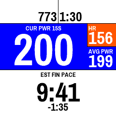
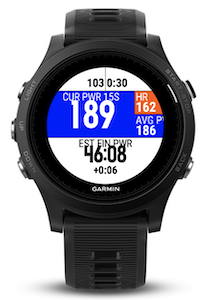
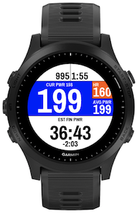
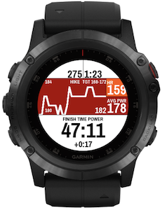
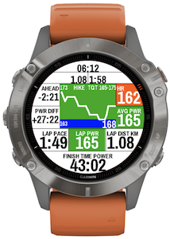

# Race With Power

RaceWithPower is a Garmin datafield designed to show you useful metrics while racing with power as main metric.

It is available in the ConnectIQ store at this address : https://apps.garmin.com/en-US/apps/23f7088a-4187-43ae-aa38-53b0160a541c

# Fields and features

1. Time of day
2. Total distance (corrected)
3. Total duration
4. Ahead/Behind for elapsed distance
5. Current power (averaged on custom window)
6. Heart rate, optionally coloured by zone
7. Difference between current power/pace and target time for remaining distance
8. Average power for the whole race
9. Current lap pace (corrected)
10. Current lap power (corrected)
11. Current lap distance (corrected)
12. ETA/Predicted end time based on current lap power and pace

Customization is possible :
* Alert outside of race power target
* Correct distance by pressing on a lap button (within -/+ 10% of the lap distance)
* Choose colors to display (None, Foreground only, Background and Foreground)
* Choose to use custom font (narrower) or standard.
* Disable the current time of day display
* Disable the lap details display
* Choose between ETA and Predicted end time.
* Display a power graph over 30 seconds instead of a single metric.
* Trail Mode
  * Automatically adjust power targets (flat, hiking, uphill and downhill values)
  * Decrease power targets after a certain number of hours
# Settings

* Show power in raw value or percentage of FTP
* Set up race parameters : distance, elevation, target power (percentage or raw value depending on preceding option) and target time.
* Set up bandwith for alerts (+/- n percent of target power)
* Choose various settings for trail mode
* Choose power averaging window (1-30 seconds)
* Enable alerts outside of race power target

# Screenshots

When disabling advanced options, you can obtain a more "minimalist" field.

It is also possible to use the trail mode and show an historical graph of your power, be it in minimal or full layout.

### Pragati Font License

Copyright (c) 2012-2015, Omnibus-Type (www.omnibus-type.com omnibus.type@gmail.com)

Licensed under the [SIL Open Font License, 1.1](https://scripts.sil.org/cms/scripts/page.php?site_id=nrsi&id=OFL)